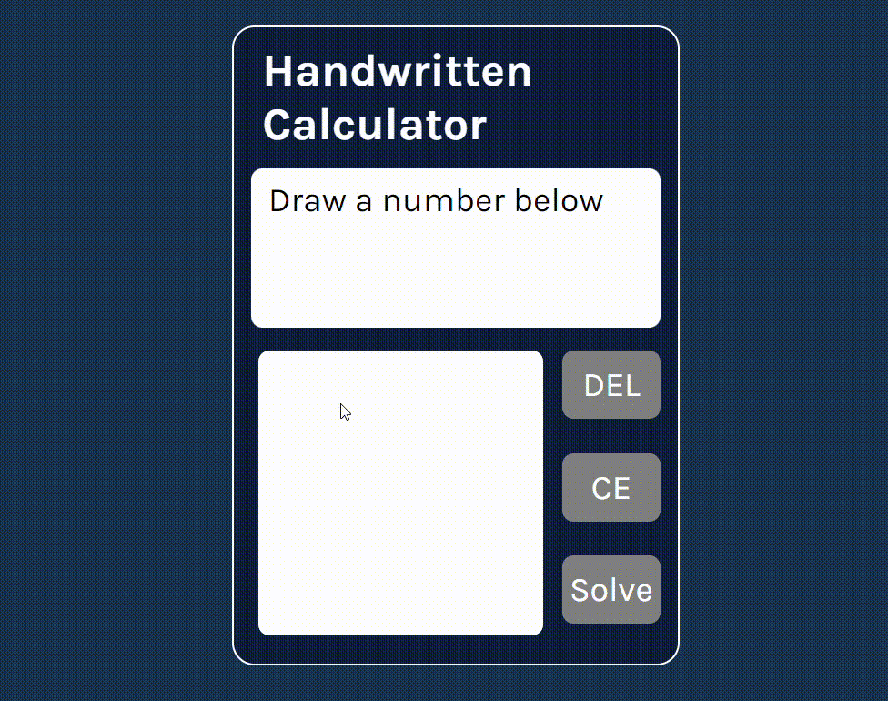

<h1> Handwritten Arithmetic Calculator </h1>
A calculator where users can draw numbers and operations to form an arithmetic expression to calculate
<ul>
  <li> Convolutional Neural Network created with PyTorch </li>
  <li> Dataset provided by <a href="https://www.kaggle.com/datasets/sagyamthapa/handwritten-math-symbols">Handwritten Math Symbols - Sagyam Thapa</a> </li>
</ul>

<h2>Features</h2>
<ul>
  <li> Users can draw on a canvas element to form a number or arithmetic operation </li>
  <li> To solve the expression, users can draw an equal sign or click 'Solve' </li>
  <li> Users also have the ability to undo and clear entry </li>
</ul>

<h2>Future Implementation Goals</h2>
<ul>
  <li> Ability to write out whole expressions </li>
  <li> Implement toBlob() instead of toDataURL() </li>
  <li> Current version uses eval(), which is unsecure and may output inaccuracies </li>
</ul>